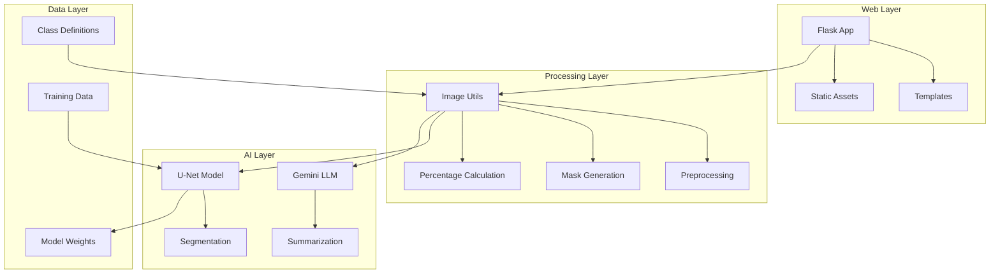
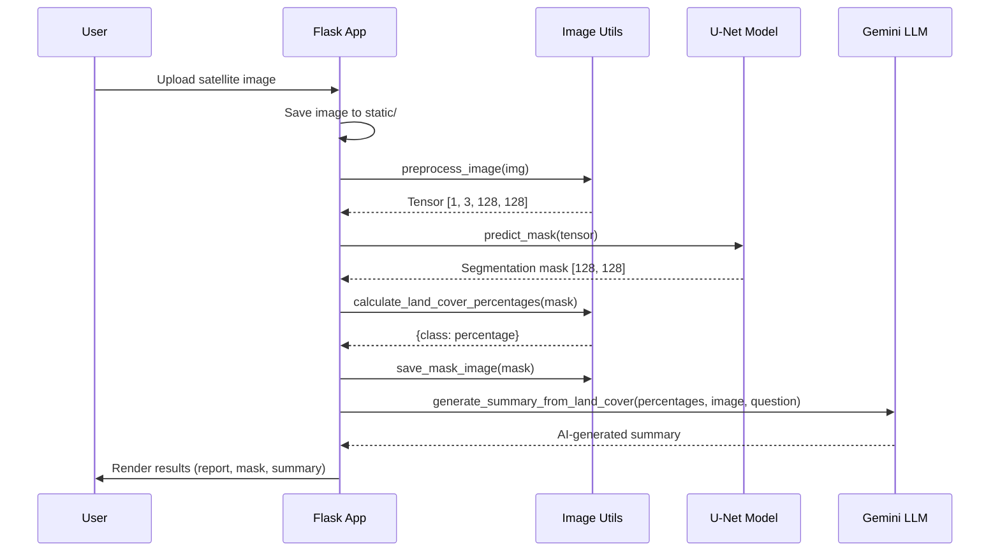
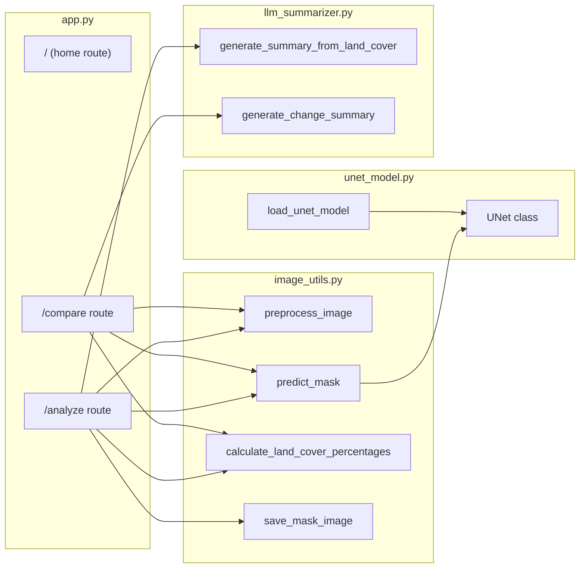
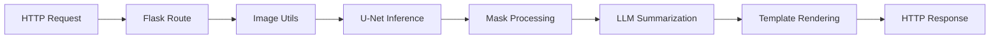
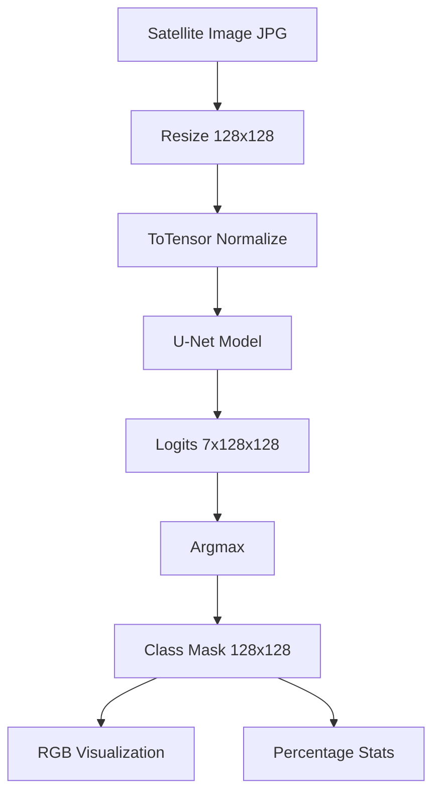
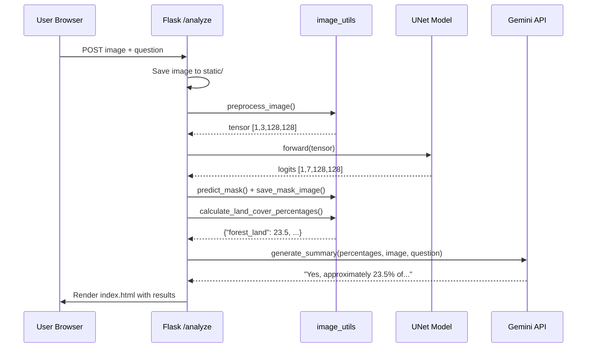

# Query-Driven Remote Sensing Data Interpretation - Developer Guide

## 1. Overview & Summary

### Purpose

This application is a **satellite image analysis platform** that combines deep learning-based semantic segmentation with Large Language Model (LLM) intelligence. It enables users to upload satellite imagery, automatically classify land cover types using a U-Net neural network, and receive AI-generated summaries and answers to natural language queries about the imagery.

The system is designed for geospatial research, environmental monitoring, and institutional use cases such as ISRO, academia, and urban planning organizations. It provides two primary workflows: single image analysis for land cover classification and temporal change detection between two satellite images.

### Key Features

- **Land Cover Segmentation**: U-Net model classifies satellite pixels into 7 land cover categories
- **Query-Driven Analysis**: Ask natural language questions about satellite images
- **Change Detection**: Compare two temporal images to identify land use changes
- **LLM-Powered Summaries**: Google Gemini generates intelligent analysis reports
- **Web Interface**: Flask-based portal with intuitive upload and visualization
- **Evaluation Tools**: Scripts for model accuracy assessment (IoU, Pixel Accuracy)

### Technology Stack

| Category          | Technology                    |
| ----------------- | ----------------------------- |
| Backend Framework | Flask (Python)                |
| Deep Learning     | PyTorch, torchvision          |
| Neural Network    | U-Net (custom implementation) |
| LLM Integration   | Google Gemini 2.0 Flash       |
| Image Processing  | Pillow, OpenCV, NumPy         |
| Frontend          | HTML5, CSS3, Jinja2 Templates |
| Data Analysis     | Pandas, Matplotlib            |

---

## 2. Architecture

### High-Level Architecture

The system follows a layered architecture with clear separation between the web layer, processing layer, and AI layer.



### Sequence Diagram - Single Image Analysis



### Component Diagram



### Design Patterns

| Pattern      | Usage                                                                             | Location                                 |
| ------------ | --------------------------------------------------------------------------------- | ---------------------------------------- |
| **MVC**      | Separation of routes (Controller), templates (View), and processing logic (Model) | `app.py`, `templates/`, `image_utils.py` |
| **Factory**  | `load_unet_model()` creates and configures model instances                        | `unet_model.py:37-41`                    |
| **Facade**   | `image_utils.py` provides simplified interface to complex image operations        | `image_utils.py`                         |
| **Strategy** | Different prompt strategies for single analysis vs. change detection              | `llm_summarizer.py`                      |

### Design Principles

- **Single Responsibility**: Each module handles one concern (model, image processing, LLM, web)
- **Separation of Concerns**: Web layer doesn't contain ML logic; ML layer doesn't know about HTTP
- **DRY**: Common preprocessing logic centralized in `image_utils.py`
- **Loose Coupling**: Components communicate through well-defined interfaces

---

## 3. Core Components

### 3.1 U-Net Model (`unet_model.py`)

**Purpose**: Semantic segmentation neural network for pixel-wise land cover classification.

**When Invoked**: Called during inference when a user uploads an image for analysis.

**Key Methods**:

```python
class UNet(nn.Module):
    def __init__(self, num_classes=7)      # Initialize encoder-decoder architecture
    def forward(self, x) -> Tensor          # Forward pass returning logits [B, C, H, W]

def load_unet_model(num_classes=7, weight_path="unet_weights.pth") -> UNet
    # Factory function to load pre-trained model
```

**Data Flow**:

```
Input Image [3, 128, 128]
    → Encoder (enc1 → pool1 → enc2 → pool2)
    → Bottleneck
    → Decoder (upconv2 + skip → dec2 → upconv1 + skip → dec1)
    → Final Conv
    → Output Logits [7, 128, 128]
```

**Architecture Details**:

- **Encoder**: Two CBR (Conv-BatchNorm-ReLU) blocks with max pooling
- **Bottleneck**: CBR block at lowest resolution
- **Decoder**: Transposed convolutions with skip connections from encoder
- **Output**: 1x1 convolution to map to `num_classes` channels

### 3.2 Image Utilities (`image_utils.py`)

**Purpose**: Image preprocessing, mask prediction, and post-processing utilities.

**Key Functions**:

| Function                           | Signature                    | Purpose                               |
| ---------------------------------- | ---------------------------- | ------------------------------------- |
| `preprocess_image`                 | `(img: Image) -> Tensor`     | Resize to 128x128, convert to tensor  |
| `predict_mask`                     | `(model, tensor) -> ndarray` | Run inference, return argmax mask     |
| `calculate_land_cover_percentages` | `(mask) -> dict`             | Compute class distribution            |
| `save_mask_image`                  | `(mask, path)`               | Convert class indices to RGB and save |

**Constants**:

```python
color_map = {
    0: (0, 255, 255),     # urban_land (cyan)
    1: (255, 255, 0),     # agriculture_land (yellow)
    2: (255, 0, 255),     # rangeland (magenta)
    3: (0, 255, 0),       # forest_land (green)
    4: (0, 0, 255),       # water (blue)
    5: (255, 255, 255),   # barren_land (white)
    6: (0, 0, 0)          # unknown (black)
}
```

### 3.3 LLM Summarizer (`llm_summarizer.py`)

**Purpose**: Generate natural language summaries and answer queries using Google Gemini.

**When Invoked**: After segmentation is complete and percentages are calculated.

**Key Functions**:

```python
def generate_summary_from_land_cover(
    percentages: dict,
    image_path: str,
    user_question: str = None
) -> str
    # Single image analysis with optional Q&A

def generate_change_summary(
    report1: dict,
    report2: dict
) -> str
    # Compare two temporal land cover reports
```

**Data Flow**:

```
Percentages Dict + Image + Optional Question
    → Prompt Construction
    → Gemini API Call (multimodal)
    → Natural Language Response
```

**Dependencies**: Requires `GEMINI_API_KEY` environment variable.

### 3.4 Flask Application (`app.py`)

**Purpose**: Web server and request routing.

**Routes**:

| Route      | Method    | Purpose                          |
| ---------- | --------- | -------------------------------- |
| `/`        | GET       | Home page with navigation        |
| `/analyze` | GET, POST | Single image upload and analysis |
| `/compare` | GET, POST | Two-image change detection       |

**Global State**:

```python
UPLOAD_FOLDER = "static"
MODEL = load_unet_model(num_classes=7)  # Loaded once at startup
```

---

## 4. Services & External Dependencies

### External Services

| Service           | Purpose                   | Configuration              |
| ----------------- | ------------------------- | -------------------------- |
| Google Gemini API | LLM for summaries and Q&A | `GEMINI_API_KEY` in `.env` |

### Internal Service Flow



### Configuration

**Environment Variables** (`.env`):

```bash
GEMINI_API_KEY=your_google_gemini_api_key
```

**Model Configuration** (`train_unet.py`):

```python
IMG_SIZE = 128          # Input image dimensions
BATCH_SIZE = 2          # Training batch size
EPOCHS = 10             # Training epochs
LEARNING_RATE = 1e-3    # Adam optimizer LR
```

---

## 5. Data Management

### Data Models

**Land Cover Classes** (`data/class_dict.csv`):

```csv
name,r,g,b
urban_land,0,255,255
agriculture_land,255,255,0
rangeland,255,0,255
forest_land,0,255,0
water,0,0,255
barren_land,255,255,255
unknown,0,0,0
```

### Directory Structure

```
data/
├── train/                  # Training images and masks
│   ├── XXXXX_sat.jpg      # Satellite images
│   └── XXXXX_mask.png     # Ground truth masks (RGB encoded)
└── class_dict.csv         # Class definitions

evaluation_images/          # Test satellite images
evaluation_masks/           # Ground truth for evaluation
predicted_masks/            # Model predictions
static/                     # Uploaded images and generated masks
```

### Data Flow



---

## 6. Sequence Flow Example: User Uploads Satellite Image

**Scenario**: A user uploads a satellite image and asks "Is there any forest in this area?"

### Step-by-Step Flow

1. **Entry Point**: User submits form at `/analyze` endpoint (`app.py:31-54`)

2. **Image Save**: Flask saves uploaded file to `static/uploaded.png`

   ```python
   img_path = os.path.join(UPLOAD_FOLDER, "uploaded.png")
   image.save(img_path)
   ```

3. **Image Load & Preprocess** (`image_utils.py:11-16`):

   ```python
   img = Image.open(img_path).convert("RGB")
   tensor = preprocess_image(img)  # Returns [1, 3, 128, 128]
   ```

4. **U-Net Inference** (`image_utils.py:19-26`):

   ```python
   mask = predict_mask(MODEL, tensor)
   # Model outputs logits [1, 7, 128, 128]
   # Argmax produces mask [128, 128] with class indices 0-6
   ```

5. **Mask Visualization** (`image_utils.py:39-43`):

   ```python
   save_mask_image(mask, "static/mask.png")
   # Converts class indices to RGB colors
   ```

6. **Statistics Calculation** (`image_utils.py:29-36`):

   ```python
   percentages = calculate_land_cover_percentages(mask)
   # Returns: {"forest_land": 23.5, "urban_land": 45.2, ...}
   ```

7. **LLM Query** (`llm_summarizer.py:11-35`):

   ```python
   summary = generate_summary_from_land_cover(
       percentages, img_path,
       question="Is there any forest in this area?"
   )
   # Sends multimodal request to Gemini with image + prompt
   ```

8. **Response Rendering**: Template displays report, mask image, and AI answer

### Sequence Diagram



---

## 7. User Journey

### Primary User Flows

**Flow 1: Single Image Analysis**

1. User navigates to home page (`/`)
2. Clicks "Single Image Analysis"
3. Uploads satellite image (JPEG/PNG)
4. Optionally enters a question
5. Clicks "Analyze Image" or "Ask Question"
6. Views land cover report, segmentation mask, and AI summary

**Flow 2: Change Detection**

1. User navigates to home page (`/`)
2. Clicks "Change Detection"
3. Uploads two temporal images (earlier and later)
4. Optionally enters a question about changes
5. Clicks "Analyze Changes"
6. Views change summary comparing land cover between images

### User Types

| Persona                   | Use Case                                       |
| ------------------------- | ---------------------------------------------- |
| **Researcher**            | Analyze land use patterns, export statistics   |
| **Environmental Analyst** | Monitor deforestation, urbanization trends     |
| **Urban Planner**         | Assess urban sprawl, infrastructure impact     |
| **Student**               | Learn about remote sensing and computer vision |

### Common Use Cases

1. **Forest Cover Assessment**: Upload forest region image, ask "What percentage is forest?"
2. **Urbanization Monitoring**: Compare old vs new images to detect urban expansion
3. **Agricultural Analysis**: Identify agricultural land distribution
4. **Water Body Detection**: Locate and quantify water features
5. **Land Use Change**: Track temporal changes in land cover composition

---

## 8. Developer Commands & Scripts

### Setup

```bash
# Clone and enter project
cd /Users/sanjeevmurthy/Documents/Nikil/Querydriven

# Create virtual environment
python -m venv venv
source venv/bin/activate  # On Windows: venv\Scripts\activate

# Install dependencies
pip install -r requirements.txt

# Additional dependencies (may be needed)
pip install google-generativeai python-dotenv pandas scikit-learn tqdm matplotlib

# Set up environment variables (see detailed instructions below)
echo "GEMINI_API_KEY=your_api_key_here" > .env
```

### Gemini API Key Configuration

This project requires a Google Gemini API key for LLM-powered summaries and Q&A functionality.

#### Step 1: Access Google AI Studio

Navigate to **[https://aistudio.google.com/app/apikey](https://aistudio.google.com/app/apikey)** and sign in with your Google account.

#### Step 2: Create API Key

1. Click **"Create API Key"**
2. Select **"Create API Key in new project"** (or choose an existing Google Cloud project)
3. Copy the generated API key (format: `AIzaSy...`)

> [!IMPORTANT]
> Save the API key immediately—you cannot view it again after closing the dialog.

#### Step 3: Configure Environment Variable

Create a `.env` file in the project root:

```bash
cd /Users/sanjeevmurthy/Documents/Nikil/Querydriven
echo "GEMINI_API_KEY=AIzaSy...your_actual_key..." > .env
```

Or manually create `.env` with:

```
GEMINI_API_KEY=your_actual_api_key_here
```

#### Step 4: Verify Configuration

Test your API key with this Python snippet:

```python
import google.generativeai as genai
from dotenv import load_dotenv
import os

load_dotenv()
genai.configure(api_key=os.getenv("GEMINI_API_KEY"))
model = genai.GenerativeModel("gemini-2.0-flash")
response = model.generate_content("Hello, world!")
print(response.text)
```

> [!NOTE]
> The `.env` file should NOT be committed to version control. Add it to `.gitignore`.

### Running Locally

```bash
# Start Flask development server
python app.py
# Server runs at http://127.0.0.1:5000

# Or with Flask CLI
export FLASK_APP=app.py
flask run --debug
```

### Training the Model

```bash
# Train U-Net on satellite imagery dataset
python train_unet.py
# Outputs: unet_weights.pth
```

### Testing & Evaluation

```bash
# Generate predictions on evaluation set
python predict_eval_masks.py
# Outputs: predicted_masks/*.png

# Calculate accuracy metrics
python accuracy_eval.py
# Outputs: corrected_accuracy_results.csv

# Test single image prediction with visualization
python predict_and_summarize.py
```

### CLI Prediction

```bash
# Modify IMAGE_PATH in predict_and_summarize.py, then:
python predict_and_summarize.py
```

---

## 9. Libraries & Frameworks Reference

| Library/Framework   | Version | Purpose                        | Documentation                                                             |
| ------------------- | ------- | ------------------------------ | ------------------------------------------------------------------------- |
| Flask               | Latest  | Web application framework      | [flask.palletsprojects.com](https://flask.palletsprojects.com/)           |
| PyTorch             | Latest  | Deep learning framework        | [pytorch.org/docs](https://pytorch.org/docs/)                             |
| torchvision         | Latest  | Image transforms, datasets     | [pytorch.org/vision](https://pytorch.org/vision/)                         |
| Pillow              | Latest  | Image loading and manipulation | [pillow.readthedocs.io](https://pillow.readthedocs.io/)                   |
| NumPy               | Latest  | Numerical operations           | [numpy.org/doc](https://numpy.org/doc/)                                   |
| OpenCV              | Latest  | Computer vision utilities      | [docs.opencv.org](https://docs.opencv.org/)                               |
| google-generativeai | Latest  | Gemini LLM API client          | [ai.google.dev/docs](https://ai.google.dev/docs)                          |
| pandas              | Latest  | Data manipulation              | [pandas.pydata.org/docs](https://pandas.pydata.org/docs/)                 |
| scikit-learn        | Latest  | Train/test splitting           | [scikit-learn.org](https://scikit-learn.org/)                             |
| python-dotenv       | Latest  | Environment variable loading   | [pypi.org/project/python-dotenv](https://pypi.org/project/python-dotenv/) |
| matplotlib          | Latest  | Visualization (evaluation)     | [matplotlib.org/stable/](https://matplotlib.org/stable/)                  |
| tqdm                | Latest  | Progress bars                  | [tqdm.github.io](https://tqdm.github.io/)                                 |

---

## 10. Debugging Guide

### Log Locations

- **Flask Logs**: Console output when running `python app.py`
- **Debug Mode**: Enabled by default (`app.run(debug=True)`)

### Enable Verbose Logging

```python
# Add to app.py
import logging
logging.basicConfig(level=logging.DEBUG)
```

### Common Issues & Solutions

| Issue                                      | Cause                  | Solution                                  |
| ------------------------------------------ | ---------------------- | ----------------------------------------- |
| `ModuleNotFoundError: google.generativeai` | Missing package        | `pip install google-generativeai`         |
| `KeyError: 'GEMINI_API_KEY'`               | Missing .env file      | Create `.env` with `GEMINI_API_KEY=...`   |
| `RuntimeError: CUDA out of memory`         | GPU memory             | Model uses CPU by default; check `DEVICE` |
| Blank segmentation mask                    | Model not loaded       | Verify `unet_weights.pth` exists          |
| Low accuracy results                       | Training data mismatch | Ensure mask colors match `class_dict.csv` |
| `FileNotFoundError: unet_weights.pth`      | Missing weights        | Run `python train_unet.py` first          |

### Debugging Tools

```python
# Add breakpoints in VS Code or use pdb
import pdb; pdb.set_trace()

# Print tensor shapes during inference
print(f"Input shape: {tensor.shape}")  # Expected: [1, 3, 128, 128]
print(f"Output shape: {output.shape}")  # Expected: [1, 7, 128, 128]
print(f"Mask shape: {mask.shape}")      # Expected: [128, 128]
```

### Inspecting Model Predictions

```python
# In predict_and_summarize.py
import matplotlib.pyplot as plt
plt.imshow(predicted_mask, cmap='tab20')
plt.colorbar()
plt.show()
```

---

## 11. Code Navigation Tips

### Entry Points

| Purpose             | File                       | Line                             |
| ------------------- | -------------------------- | -------------------------------- |
| Web Application     | `app.py`                   | `app.run(debug=True)` at line 93 |
| Model Training      | `train_unet.py`            | `train()` at line 112            |
| Batch Prediction    | `predict_eval_masks.py`    | `predict_and_save()` at line 36  |
| Single Prediction   | `predict_and_summarize.py` | `main()` at line 54              |
| Accuracy Evaluation | `accuracy_eval.py`         | Line 46 (main loop)              |

### Critical Paths

1. **Inference Pipeline**: `app.py:42-45` → `image_utils.py:11-26` → `unet_model.py:28-34`
2. **LLM Integration**: `app.py:50` → `llm_summarizer.py:11-35`
3. **Training Loop**: `train_unet.py:75-110`

### File Organization

```
Querydriven/
├── app.py                    # Flask web application (routes)
├── unet_model.py             # U-Net architecture definition
├── image_utils.py            # Image preprocessing utilities
├── llm_summarizer.py         # Gemini LLM integration
├── train_unet.py             # Model training script
├── predict_and_summarize.py  # CLI inference + visualization
├── predict_eval_masks.py     # Batch prediction for evaluation
├── accuracy_eval.py          # IoU and accuracy calculation
├── unet_weights.pth          # Pre-trained model weights (~7MB)
├── requirements.txt          # Python dependencies
├── .env                      # API keys (not in version control)
├── templates/                # Jinja2 HTML templates
│   ├── home.html            # Landing page
│   ├── index.html           # Single analysis page
│   └── compare.html         # Change detection page
├── static/                   # CSS, images, uploads
│   └── style.css            # Main stylesheet
├── data/                     # Training data
│   ├── train/               # Satellite images + masks
│   └── class_dict.csv       # Class definitions
├── evaluation_images/        # Test images
├── evaluation_masks/         # Ground truth masks
└── predicted_masks/          # Model predictions
```

### Naming Conventions

- **Files**: `snake_case.py`
- **Classes**: `PascalCase` (e.g., `UNet`, `SatelliteDataset`)
- **Functions**: `snake_case` (e.g., `preprocess_image`, `load_unet_model`)
- **Constants**: `UPPER_SNAKE_CASE` (e.g., `IMG_SIZE`, `DEVICE`)
- **Image Files**: `{id}_sat.jpg` (satellite), `{id}_mask.png` (ground truth)

---

## 12. Extension Guide

### Adding New Land Cover Classes

1. **Update `data/class_dict.csv`**:

   ```csv
   wetland,128,128,0
   ```

2. **Update `image_utils.py`**:

   ```python
   color_map[7] = (128, 128, 0)  # wetland
   class_names[7] = "wetland"
   ```

3. **Update model configuration**:

   ```python
   MODEL = load_unet_model(num_classes=8)  # In app.py
   ```

4. **Retrain the model** with new annotated data.

### Adding New Routes

```python
# In app.py
@app.route("/batch", methods=["POST"])
def batch_analyze():
    images = request.files.getlist("images")
    results = []
    for img in images:
        # Process each image
        results.append(process_single_image(img))
    return jsonify(results)
```

### Modifying LLM Prompts

Edit prompts in `llm_summarizer.py`:

```python
# For more detailed summaries
prompt = f"""
You are an expert geospatial analyst. Provide a detailed technical analysis...
Land cover data: {readable}
Include: environmental implications, urban planning recommendations...
"""
```

### Testing New Code

```python
# Create test file: test_image_utils.py
import unittest
from image_utils import preprocess_image, calculate_land_cover_percentages
from PIL import Image
import numpy as np

class TestImageUtils(unittest.TestCase):
    def test_preprocess_output_shape(self):
        img = Image.new('RGB', (256, 256))
        tensor = preprocess_image(img)
        self.assertEqual(tensor.shape, (1, 3, 128, 128))

    def test_percentage_calculation(self):
        mask = np.array([[0, 0], [1, 1]])
        result = calculate_land_cover_percentages(mask)
        self.assertEqual(result['urban_land'], 50.0)
        self.assertEqual(result['agriculture_land'], 50.0)

if __name__ == '__main__':
    unittest.main()
```

### Improving Model Accuracy

1. **Increase training data** in `data/train/`
2. **Data augmentation** in `train_unet.py`:
   ```python
   self.img_transform = transforms.Compose([
       transforms.Resize((IMG_SIZE, IMG_SIZE)),
       transforms.RandomHorizontalFlip(),
       transforms.RandomRotation(10),
       transforms.ToTensor()
   ])
   ```
3. **Deeper U-Net**: Add more encoder/decoder blocks
4. **Use pretrained encoders**: Replace encoder with ResNet backbone

---

## Appendix: Model Performance

Current evaluation results show variable performance across test images:

| Metric         | Range         | Notes                |
| -------------- | ------------- | -------------------- |
| Mean IoU       | 0.003 - 0.226 | Best: 37586 (0.226)  |
| Pixel Accuracy | 1.7% - 97%    | Best: 37755 (97.02%) |

**Recommendations for improvement**:

- Increase training dataset size
- Add data augmentation
- Implement class balancing (weighted loss)
- Use deeper architecture or transfer learning

---

_Generated for M.Tech Major Project | Query-Driven Remote Sensing Data Interpretation_
_Built with Flask, PyTorch, U-Net, and Google Gemini AI_
