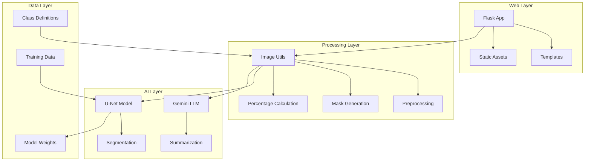
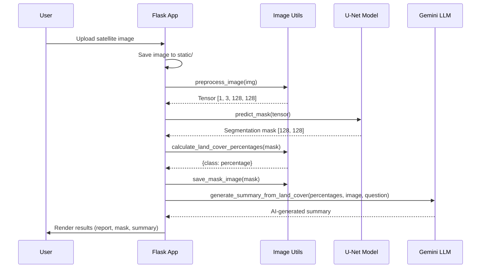
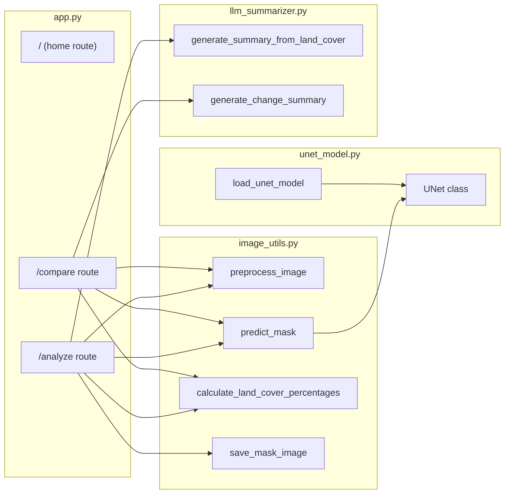
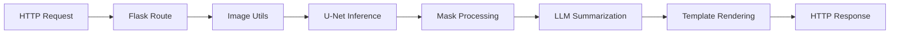
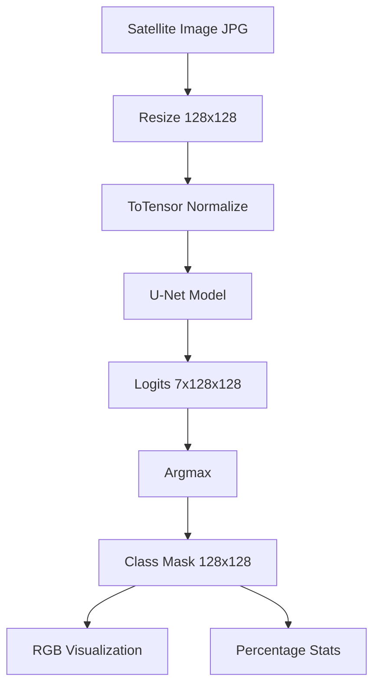
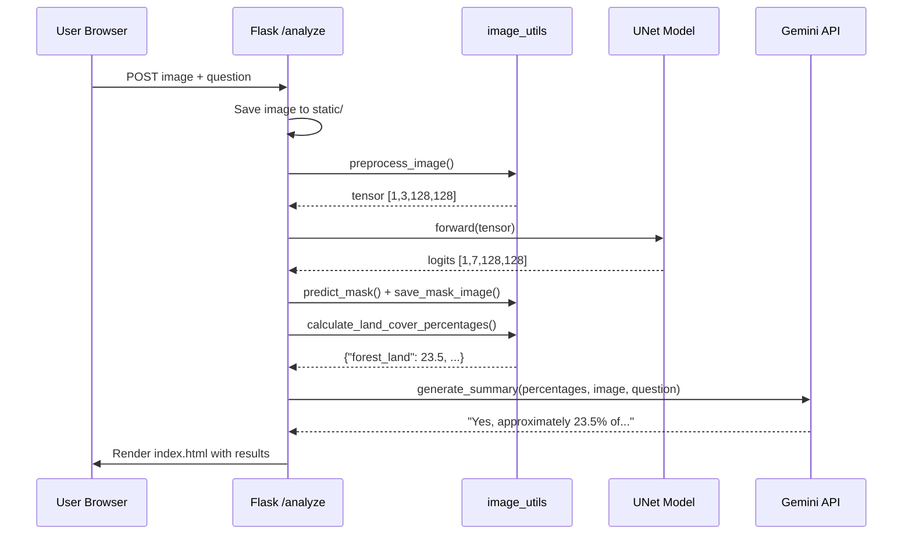

# Query-Driven Remote Sensing Data Interpretation - Developer Guide

## Table of Contents

- [1. Overview & Summary](#1-overview--summary)
  - [Purpose](#purpose)
  - [Key Features](#key-features)
  - [Technology Stack](#technology-stack)
- [2. Architecture](#2-architecture)
  - [High-Level Architecture](#high-level-architecture)
  - [Sequence Diagram - Single Image Analysis](#sequence-diagram---single-image-analysis)
  - [Component Diagram](#component-diagram)
  - [Design Patterns](#design-patterns)
  - [Design Principles](#design-principles)
- [3. Core Components](#3-core-components)
  - [3.1 U-Net Model](#31-u-net-model-unet_modelpy)
  - [3.2 Image Utilities](#32-image-utilities-image_utilspy)
  - [3.3 LLM Summarizer](#33-llm-summarizer-llm_summarizerpy)
  - [3.4 Flask Application](#34-flask-application-apppy)
- [4. Services & External Dependencies](#4-services--external-dependencies)
  - [External Services](#external-services)
  - [Internal Service Flow](#internal-service-flow)
  - [Configuration](#configuration)
- [5. Data Management](#5-data-management)
  - [Data Models](#data-models)
  - [Directory Structure](#directory-structure)
  - [Data Flow](#data-flow)
- [6. Sequence Flow Example: User Uploads Satellite Image](#6-sequence-flow-example-user-uploads-satellite-image)
  - [Step-by-Step Flow](#step-by-step-flow)
  - [Sequence Diagram](#sequence-diagram)
- [7. User Journey](#7-user-journey)
  - [Primary User Flows](#primary-user-flows)
  - [User Types](#user-types)
  - [Common Use Cases](#common-use-cases)
- [8. Developer Commands & Scripts](#8-developer-commands--scripts)
  - [Setup](#setup)
  - [Gemini API Key Configuration](#gemini-api-key-configuration)
  - [Running Locally](#running-locally)
  - [Training the Model](#training-the-model)
  - [Testing & Evaluation](#testing--evaluation)
  - [CLI Prediction](#cli-prediction)
- [9. Libraries & Frameworks Reference](#9-libraries--frameworks-reference)
- [10. Debugging Guide](#10-debugging-guide)
  - [Log Locations](#log-locations)
  - [Enable Verbose Logging](#enable-verbose-logging)
  - [Common Issues & Solutions](#common-issues--solutions)
  - [Debugging Tools](#debugging-tools)
  - [Inspecting Model Predictions](#inspecting-model-predictions)
- [11. Code Navigation Tips](#11-code-navigation-tips)
  - [Entry Points](#entry-points)
  - [Critical Paths](#critical-paths)
  - [File Organization](#file-organization)
  - [Naming Conventions](#naming-conventions)
- [12. Extension Guide](#12-extension-guide)
  - [Adding New Land Cover Classes](#adding-new-land-cover-classes)
  - [Adding New Routes](#adding-new-routes)
  - [Modifying LLM Prompts](#modifying-llm-prompts)
  - [Testing New Code](#testing-new-code)
  - [Improving Model Accuracy](#improving-model-accuracy)
- [Appendix: Model Performance](#appendix-model-performance)

---

## 1. Overview & Summary

### Purpose

This application is a **satellite image analysis platform** that combines deep learning-based semantic segmentation with Large Language Model (LLM) intelligence. It enables users to upload satellite imagery, automatically classify land cover types using a U-Net neural network, and receive AI-generated summaries and answers to natural language queries about the imagery.

**Semantic segmentation** means the model assigns a class label to every pixel in the image — rather than just drawing a bounding box around objects, it produces a full pixel-wise map that shows exactly which parts of the scene are forest, water, urban area, etc. This granularity is what makes the analysis useful for measuring area percentages and detecting fine-grained change over time.

The **query-driven** aspect means the system goes beyond static reports. After segmentation, users can ask free-form questions in plain English (e.g., "Has urban area increased near the river?"), and Google Gemini interprets both the segmentation statistics and the raw image to produce a contextual, human-readable answer. This bridges the gap between raw ML output and actionable geospatial insight.

The system is designed for geospatial research, environmental monitoring, and institutional use cases such as ISRO, academia, and urban planning organizations. It provides two primary workflows: single image analysis for land cover classification and temporal change detection between two satellite images.

### Key Features

- **Land Cover Segmentation**: The U-Net model performs pixel-wise classification of satellite imagery into 7 land cover categories (urban, agriculture, rangeland, forest, water, barren, unknown). Each pixel in the output mask is assigned exactly one class, enabling precise area measurement.

- **Query-Driven Analysis**: Users can type a natural language question alongside their uploaded image. The question is forwarded to Google Gemini together with the segmentation statistics and the original image, allowing the LLM to provide a contextually rich answer grounded in actual pixel data rather than hallucination.

- **Change Detection**: By uploading two images from different dates (e.g., the same location one year apart), the system generates independent segmentation masks for both and then asks Gemini to compare them. The result is a narrative summary of what changed — useful for tracking deforestation, urban sprawl, or flood extent.

- **LLM-Powered Summaries**: Google Gemini 2.0 Flash is a multimodal model, meaning it can process both text and images in a single request. The system passes the original satellite image alongside the computed statistics, so Gemini can cross-reference visual detail it sees directly with the numbers the model produced.

- **Web Interface**: A Flask-based portal handles file upload, triggers the ML pipeline, and renders results in the browser. Jinja2 templates keep the HTML maintainable, while the static folder serves generated mask images back to the user.

- **Evaluation Tools**: Dedicated scripts (`accuracy_eval.py`, `predict_eval_masks.py`) run the trained model over held-out test images and compute standard segmentation metrics (mean Intersection over Union and pixel accuracy) so model quality can be measured objectively.

### Technology Stack

| Category          | Technology                    | Why This Choice |
| ----------------- | ----------------------------- | --------------- |
| Backend Framework | Flask (Python)                | Lightweight, minimal boilerplate, easy to integrate with Python ML libraries in the same process |
| Deep Learning     | PyTorch, torchvision          | Dynamic computation graphs make debugging easier; torchvision provides standard image transforms |
| Neural Network    | U-Net (custom implementation) | U-Net's skip connections preserve spatial detail lost during downsampling — critical for accurate pixel-level segmentation |
| LLM Integration   | Google Gemini 2.0 Flash       | Natively multimodal (accepts images + text in one API call), fast inference, strong instruction-following |
| Image Processing  | Pillow, OpenCV, NumPy         | Pillow handles loading/saving; NumPy enables fast array operations on masks; OpenCV available for advanced transforms |
| Frontend          | HTML5, CSS3, Jinja2 Templates | Server-side rendering keeps the frontend simple — no JavaScript framework needed for this use case |
| Data Analysis     | Pandas, Matplotlib            | Pandas reads `class_dict.csv` and aggregates evaluation results; Matplotlib renders accuracy charts |

---

## 2. Architecture

### High-Level Architecture

The system follows a **layered architecture** with clear separation between the web layer, processing layer, and AI layer. Each layer has a single responsibility and communicates with adjacent layers through well-defined function calls — no layer reaches across two levels.

- **Web Layer** (`app.py` + `templates/`): Handles HTTP request/response, file I/O for uploads, and rendering results back to the browser. Contains no ML logic.
- **Processing Layer** (`image_utils.py`): Converts raw image files into tensors suitable for the model, runs inference, and post-processes the output mask into statistics and RGB visualizations. Contains no knowledge of HTTP.
- **AI Layer** (`unet_model.py` + `llm_summarizer.py`): Defines and loads the neural network; sends prompts to Gemini. Operates purely on Python objects (tensors, dicts, strings) with no awareness of files or HTTP.
- **Data Layer**: The trained weights file (`unet_weights.pth`) and class definitions (`class_dict.csv`) are static artifacts read at startup and during inference. They do not change at runtime.



### Sequence Diagram - Single Image Analysis

This diagram shows the full lifecycle of a single-image analysis request, from browser upload to rendered result. The key insight is that the Flask app orchestrates everything — it calls image utilities to produce a mask, then passes both the mask statistics and the original image to Gemini. The model and the LLM are never aware of each other.



### Component Diagram

This diagram shows which functions inside each module depend on which others. The Flask routes are the only consumers of `image_utils.py` and `llm_summarizer.py` at runtime — all business logic flows downward from `app.py`. The U-Net model is accessed exclusively through `image_utils.py:predict_mask`, so the route handlers never interact with PyTorch tensors directly.



### Design Patterns

| Pattern      | Usage                                                                             | Location                                 |
| ------------ | --------------------------------------------------------------------------------- | ---------------------------------------- |
| **MVC**      | Separation of routes (Controller), templates (View), and processing logic (Model) | `app.py`, `templates/`, `image_utils.py` |
| **Factory**  | `load_unet_model()` creates and configures model instances                        | `unet_model.py:37-41`                    |
| **Facade**   | `image_utils.py` provides simplified interface to complex image operations        | `image_utils.py`                         |
| **Strategy** | Different prompt strategies for single analysis vs. change detection              | `llm_summarizer.py`                      |

**MVC** keeps HTML rendering completely separate from ML logic. Templates receive plain Python dicts (class names + percentages) and render them — they have no knowledge of tensors or model internals.

**Factory** (`load_unet_model`) handles all the complexity of constructing a `UNet`, loading weights from disk, moving to the correct device, and switching to `eval()` mode. Callers just call `load_unet_model()` and get a ready-to-use model object.

**Facade** (`image_utils.py`) hides the five-step preprocessing pipeline (open → convert → resize → tensor → normalize) behind a single function call `preprocess_image(img)`. The route handler doesn't need to know the intermediate steps.

**Strategy** means the LLM prompt is constructed differently depending on the use case. `generate_summary_from_land_cover` builds a prompt for a single-image question-and-answer scenario, while `generate_change_summary` builds a prompt that focuses on comparing two sets of statistics. The calling code doesn't need to know how the prompts differ.

### Design Principles

- **Single Responsibility**: Each module handles one concern (model, image processing, LLM, web). Adding a new route doesn't require touching `unet_model.py`; changing the LLM provider doesn't require touching `image_utils.py`.

- **Separation of Concerns**: The web layer doesn't contain ML logic; the ML layer doesn't know about HTTP. This means you can run inference in a notebook or a CLI script by importing `image_utils` directly, without standing up a Flask server.

- **DRY (Don't Repeat Yourself)**: Both `/analyze` and `/compare` routes need to preprocess images and run the model. That logic lives once in `image_utils.py` rather than being duplicated inside each route handler.

- **Loose Coupling**: Components communicate through well-defined interfaces (Python function signatures). The Flask app passes a PIL `Image` object to `preprocess_image` and receives a NumPy array from `predict_mask` — neither side cares how the other is implemented internally.

---

## 3. Core Components

### 3.1 U-Net Model (`unet_model.py`)

**Purpose**: Semantic segmentation neural network for pixel-wise land cover classification.

**Background — What is U-Net?**

U-Net is a convolutional neural network architecture originally developed for biomedical image segmentation. It has two halves: an **encoder** (contracting path) that progressively reduces spatial resolution while increasing feature depth, and a **decoder** (expanding path) that restores spatial resolution. The defining feature of U-Net is **skip connections** — feature maps from each encoder stage are concatenated directly into the corresponding decoder stage. This allows the decoder to recover fine spatial detail that would otherwise be lost during downsampling, which is essential for accurate pixel-level predictions.

**When Invoked**: Called during inference when a user uploads an image for analysis.

**Key Methods**:

```python
class UNet(nn.Module):
    def __init__(self, num_classes=7)      # Initialize encoder-decoder architecture
    def forward(self, x) -> Tensor          # Forward pass returning logits [B, C, H, W]

def load_unet_model(num_classes=7, weight_path="unet_weights.pth") -> UNet
    # Factory function to load pre-trained model
```

**Data Flow**:

```
Input Image [3, 128, 128]
    → Encoder (enc1 → pool1 → enc2 → pool2)
    → Bottleneck
    → Decoder (upconv2 + skip → dec2 → upconv1 + skip → dec1)
    → Final Conv
    → Output Logits [7, 128, 128]
```

**Architecture Details**:

- **Encoder**: Two CBR (Conv-BatchNorm-ReLU) blocks with max pooling. Each block applies a 3×3 convolution to extract features, normalizes with BatchNorm (stabilizes training), and applies ReLU activation. Max pooling halves the spatial dimensions (128→64→32) while the channel count increases, forcing the network to learn progressively more abstract representations.

- **Bottleneck**: A CBR block at the lowest resolution (32×32). This is the "compressed" representation of the image where the network captures global context. It has the most channels and least spatial detail.

- **Decoder**: Transposed convolutions (`ConvTranspose2d`) upsample the feature map back toward the original resolution. At each step, the upsampled map is concatenated with the skip connection from the matching encoder stage — this restores spatial precision lost during pooling.

- **Output**: A 1×1 convolution maps the final feature map to `num_classes` (7) channels. Each channel is the logit (unnormalized score) for one land cover class. `argmax` over the class dimension gives the predicted class for each pixel.

### 3.2 Image Utilities (`image_utils.py`)

**Purpose**: Image preprocessing, mask prediction, and post-processing utilities. This module is the bridge between raw user-uploaded files and the tensors the model expects, and between raw model output (a 2D array of integers) and the visual/statistical representations shown to the user.

**Key Functions**:

| Function                           | Signature                    | Purpose                               |
| ---------------------------------- | ---------------------------- | ------------------------------------- |
| `preprocess_image`                 | `(img: Image) -> Tensor`     | Resize to 128x128, convert to tensor  |
| `predict_mask`                     | `(model, tensor) -> ndarray` | Run inference, return argmax mask     |
| `calculate_land_cover_percentages` | `(mask) -> dict`             | Compute class distribution            |
| `save_mask_image`                  | `(mask, path)`               | Convert class indices to RGB and save |

**Why 128×128?** The model was trained on 128×128 patches of satellite imagery. All input images are resized to this resolution before inference, regardless of the original image dimensions. This is a trade-off: smaller resolution is faster and uses less memory, but loses fine spatial detail. If you retrain on higher resolution tiles, you must update `IMG_SIZE` consistently across `image_utils.py` and `train_unet.py`.

**Why ToTensor + Normalize?** PyTorch models expect float tensors with values in roughly the 0–1 range. `transforms.ToTensor()` divides pixel values by 255. Normalization using ImageNet mean/std (if applied) shifts the distribution to zero-mean unit-variance, which helps gradient flow during training.

**`predict_mask` and argmax**: The model outputs `[1, 7, 128, 128]` — one score per class per pixel. `argmax` along the class dimension collapses this to `[128, 128]`, where each value is an integer 0–6 representing the most likely class for that pixel. This is the raw segmentation mask.

**`calculate_land_cover_percentages`**: Iterates over the 7 class indices, counts pixels in the mask matching each index, and divides by total pixels. Returns a dict like `{"forest_land": 23.5, "urban_land": 45.2, ...}` where values sum to 100.

**Constants**:

```python
color_map = {
    0: (0, 255, 255),     # urban_land (cyan)
    1: (255, 255, 0),     # agriculture_land (yellow)
    2: (255, 0, 255),     # rangeland (magenta)
    3: (0, 255, 0),       # forest_land (green)
    4: (0, 0, 255),       # water (blue)
    5: (255, 255, 255),   # barren_land (white)
    6: (0, 0, 0)          # unknown (black)
}
```

These RGB colors must exactly match the ground truth mask colors in the training dataset. If they diverge, the model learns to predict the wrong class indices. `class_dict.csv` is the authoritative source for this mapping.

### 3.3 LLM Summarizer (`llm_summarizer.py`)

**Purpose**: Generate natural language summaries and answer queries using Google Gemini.

**Background — Multimodal LLM Calls**

Standard LLM APIs accept only text. Gemini 2.0 Flash is **multimodal**, meaning a single API call can include both a text prompt and one or more images. This is critical here: the segmentation model produces statistics (percentages per class), but the raw satellite image contains additional context the statistics can't capture — e.g., spatial arrangement, texture, or visual anomalies. By passing both, Gemini can produce answers that are grounded in both quantitative data and visual observation.

**When Invoked**: After segmentation is complete and percentages are calculated.

**Key Functions**:

```python
def generate_summary_from_land_cover(
    percentages: dict,
    image_path: str,
    user_question: str = None
) -> str
    # Single image analysis with optional Q&A

def generate_change_summary(
    report1: dict,
    report2: dict
) -> str
    # Compare two temporal land cover reports
```

**Prompt Construction**: The prompt sent to Gemini is built programmatically from the `percentages` dict. It tells Gemini its role ("You are a satellite image analyst"), presents the land cover statistics in a readable format, includes the image, and appends the user's question (if any). Well-crafted prompts that specify the expert role and provide structured data produce much more accurate and contextual responses.

**Data Flow**:

```
Percentages Dict + Image + Optional Question
    → Prompt Construction
    → Gemini API Call (multimodal)
    → Natural Language Response
```

**`generate_change_summary`**: Takes two report dicts (one for each temporal image) and constructs a comparison prompt. It highlights the difference in percentages for each class and asks Gemini to interpret what the changes mean environmentally or urbanistically.

**Dependencies**: Requires `GEMINI_API_KEY` environment variable. The key is loaded via `python-dotenv` from a `.env` file at startup. If the key is absent or invalid, the LLM call will raise an exception and the page will render without a summary.

### 3.4 Flask Application (`app.py`)

**Purpose**: Web server, request routing, and orchestration of the full analysis pipeline.

**How Flask Routing Works**: Flask maps URL paths to Python functions using the `@app.route()` decorator. When a browser sends a request to `/analyze`, Flask calls the decorated function, which reads the uploaded file, calls the processing functions, and returns an HTML response rendered from a Jinja2 template.

**Routes**:

| Route      | Method    | Purpose                          |
| ---------- | --------- | -------------------------------- |
| `/`        | GET       | Home page with navigation        |
| `/analyze` | GET, POST | Single image upload and analysis |
| `/compare` | GET, POST | Two-image change detection       |

The `GET` handler for `/analyze` and `/compare` renders the empty upload form. The `POST` handler receives the uploaded file(s), runs the full pipeline, and renders the results page. Having both methods on the same route keeps the URL clean.

**Global State**:

```python
UPLOAD_FOLDER = "static"
MODEL = load_unet_model(num_classes=7)  # Loaded once at startup
```

**Why is the model loaded globally?** Loading a neural network from disk (reading weights, allocating memory, initializing layers) is expensive — it can take several seconds. If it were loaded inside the route handler, every request would pay that cost. By loading it once when the process starts, subsequent requests only pay the cost of the forward pass itself. The `MODEL` object is stateless after loading (no in-memory state changes during inference), so sharing it across requests is safe.

---

## 4. Services & External Dependencies

### External Services

| Service           | Purpose                   | Configuration              |
| ----------------- | ------------------------- | -------------------------- |
| Google Gemini API | LLM for summaries and Q&A | `GEMINI_API_KEY` in `.env` |

**Google Gemini API** is the only external network dependency at runtime. All ML inference runs locally using the pre-trained weights file. This means the application can produce segmentation masks and percentage statistics even without internet access — only the LLM summary step requires a live network connection. If the Gemini call fails (network error, quota exceeded, invalid key), the application should degrade gracefully by showing the segmentation results without a summary.

**Rate Limits and Quotas**: The free tier of the Gemini API has per-minute request limits. For a class demo or single-user deployment this is unlikely to be a problem, but for multi-user deployments you should monitor API usage in Google AI Studio and consider caching repeated queries.

### Internal Service Flow

Each HTTP request triggers a synchronous chain of calls. There is no background processing, queuing, or async I/O — everything runs in the Flask request thread. For a single-user development server this is fine. For production or concurrent users, consider moving the model inference and LLM call to a task queue (e.g., Celery) to avoid blocking the web server.



### Configuration

**Environment Variables** (`.env`):

```bash
GEMINI_API_KEY=your_google_gemini_api_key
```

The `.env` file is read by `python-dotenv` at application startup via `load_dotenv()`. This keeps secrets out of source code. The file must exist in the project root directory. Never commit `.env` to version control — it is listed in `.gitignore`.

**Model Configuration** (`train_unet.py`):

```python
IMG_SIZE = 128          # Input image dimensions — must match image_utils.py
BATCH_SIZE = 2          # Training batch size — reduce if GPU OOM errors occur
EPOCHS = 10             # Training epochs — increase for better accuracy
LEARNING_RATE = 1e-3    # Adam optimizer LR — decrease if training loss oscillates
```

`IMG_SIZE` is the most critical constant. It must be identical in `train_unet.py` (where the model learns to expect 128×128 inputs) and `image_utils.py` (where images are resized before inference). A mismatch causes a tensor shape error at runtime.

---

## 5. Data Management

### Data Models

**Land Cover Classes** (`data/class_dict.csv`):

```csv
name,r,g,b
urban_land,0,255,255
agriculture_land,255,255,0
rangeland,255,0,255
forest_land,0,255,0
water,0,0,255
barren_land,255,255,255
unknown,0,0,0
```

This CSV is the single source of truth for the class-to-color mapping. During training, ground truth mask images are RGB PNGs where each pixel's color encodes the land cover class (e.g., pure green `(0, 255, 0)` means forest). The training script reads this CSV to know how to decode those colors into integer class indices (0–6) that the model predicts. The same mapping is used in `image_utils.py` to re-encode predicted class indices back into RGB for visualization. Any mismatch between training-time and inference-time color mapping corrupts the class predictions.

**Why RGB encoding for masks?** Ground truth masks are stored as RGB images rather than single-channel label images. This is a common convention in remote sensing datasets because RGB masks are human-readable — you can open them in any image viewer and immediately see what class each region belongs to by its color.

### Directory Structure

```
data/
├── train/                  # Training images and masks
│   ├── XXXXX_sat.jpg      # Satellite images (RGB, variable resolution)
│   └── XXXXX_mask.png     # Ground truth masks (RGB encoded, same resolution as satellite)
└── class_dict.csv         # Class definitions

evaluation_images/          # Held-out test satellite images (not used during training)
evaluation_masks/           # Held-out ground truth masks for accuracy evaluation
predicted_masks/            # Model predictions generated by predict_eval_masks.py
static/                     # Uploaded images and generated masks (served by Flask)
```

- `train/` pairs each satellite image with its corresponding RGB mask. The filename prefix (e.g., `37756`) links the pair: `37756_sat.jpg` and `37756_mask.png` are the same scene.
- `evaluation_images/` and `evaluation_masks/` are images never shown to the model during training. Running accuracy metrics on held-out data gives an honest picture of generalization performance.
- `predicted_masks/` is written by `predict_eval_masks.py` — it saves the model's predictions so `accuracy_eval.py` can compare them to ground truth.
- `static/` is Flask's public directory. Uploaded images are saved here as `uploaded.png`, and generated mask images as `mask.png`. Because Flask serves this folder, both files are immediately accessible by the browser via `/static/uploaded.png`.

### Data Flow



The data flow has two branches after the model produces the class mask:
1. **Visualization branch** (`save_mask_image`): Maps each integer class index to its RGB color and saves a PNG. This is what the user sees as the colorful overlay.
2. **Statistics branch** (`calculate_land_cover_percentages`): Counts pixels per class and computes proportions. This dict is what gets passed to the LLM prompt.

---

## 6. Sequence Flow Example: User Uploads Satellite Image

**Scenario**: A user uploads a satellite image and asks "Is there any forest in this area?"

### Step-by-Step Flow

1. **Entry Point**: User submits form at `/analyze` endpoint (`app.py:31-54`)

   The browser sends a `multipart/form-data` POST request containing the image file and the question string. Flask's `request.files` dict gives access to the uploaded file as a file-like object, and `request.form` gives access to the question text.

2. **Image Save**: Flask saves uploaded file to `static/uploaded.png`

   ```python
   img_path = os.path.join(UPLOAD_FOLDER, "uploaded.png")
   image.save(img_path)
   ```

   Saving to `static/` means the original image is immediately serveable to the browser without any additional routing. The filename `uploaded.png` is fixed — each new upload overwrites the previous one. For a multi-user production deployment, filenames would need to be unique (e.g., using UUIDs).

3. **Image Load & Preprocess** (`image_utils.py:11-16`):

   ```python
   img = Image.open(img_path).convert("RGB")
   tensor = preprocess_image(img)  # Returns [1, 3, 128, 128]
   ```

   `convert("RGB")` ensures the image has exactly 3 channels regardless of whether the user uploaded a JPEG (3 channels), PNG with alpha (4 channels), or grayscale image (1 channel). The model expects exactly 3. The leading `1` dimension is the batch size — PyTorch models always process batches, so even a single image is wrapped in a batch of size 1.

4. **U-Net Inference** (`image_utils.py:19-26`):

   ```python
   mask = predict_mask(MODEL, tensor)
   # Model outputs logits [1, 7, 128, 128]
   # Argmax produces mask [128, 128] with class indices 0-6
   ```

   `torch.no_grad()` is used during inference to disable gradient tracking, which saves memory and speeds up the forward pass. The logits are not converted to probabilities (softmax) because argmax gives the same result either way — we only care about which class has the highest score.

5. **Mask Visualization** (`image_utils.py:39-43`):

   ```python
   save_mask_image(mask, "static/mask.png")
   # Converts class indices to RGB colors
   ```

   Iterates over the 128×128 mask array and replaces each integer (0–6) with the corresponding RGB tuple from `color_map`. The result is a PIL `Image` that is saved to `static/mask.png` and served to the browser.

6. **Statistics Calculation** (`image_utils.py:29-36`):

   ```python
   percentages = calculate_land_cover_percentages(mask)
   # Returns: {"forest_land": 23.5, "urban_land": 45.2, ...}
   ```

   Only classes with at least one pixel will appear in the returned dict. Classes with zero pixels are omitted, which keeps the LLM prompt concise.

7. **LLM Query** (`llm_summarizer.py:11-35`):

   ```python
   summary = generate_summary_from_land_cover(
       percentages, img_path,
       question="Is there any forest in this area?"
   )
   # Sends multimodal request to Gemini with image + prompt
   ```

   The function opens the image file, constructs a structured prompt that presents the percentages in a readable format (e.g., "Forest Land: 23.5%"), appends the user's question, and sends all of this to Gemini in a single API call. Gemini replies with a natural language response that references both the statistics and what it can visually observe in the image.

8. **Response Rendering**: Template receives `percentages`, `summary`, paths to `uploaded.png` and `mask.png`, and renders them into an HTML report displayed in the browser.

### Sequence Diagram



---

## 7. User Journey

### Primary User Flows

**Flow 1: Single Image Analysis**

1. User navigates to home page (`/`) — sees cards for each analysis mode
2. Clicks "Single Image Analysis" — navigated to `/analyze` (GET), which renders the upload form
3. Uploads a satellite image (JPEG or PNG) — browser sends the file to the server via the form
4. Optionally enters a question (e.g., "How much of this area is agricultural?") — this is passed to Gemini alongside the image
5. Clicks "Analyze Image" or "Ask Question" — form is submitted as POST to `/analyze`
6. Views the results page: a land cover report table (class name + percentage), the colorized segmentation mask image, and the AI-generated text summary

**Flow 2: Change Detection**

1. User navigates to home page (`/`)
2. Clicks "Change Detection" — navigated to `/compare` (GET)
3. Uploads two temporal images — "Image 1" should be the earlier date, "Image 2" the later date; both are processed independently through the segmentation pipeline
4. Optionally enters a question about changes (e.g., "Has forest cover decreased?")
5. Clicks "Analyze Changes" — POST to `/compare`
6. Views a change summary: Gemini compares the two sets of land cover statistics and describes what changed, by how much, and what it might indicate

### User Types

| Persona                   | Use Case                                       | Typical Question |
| ------------------------- | ---------------------------------------------- | ---------------- |
| **Researcher**            | Analyze land use patterns, export statistics   | "What is the precise percentage of water bodies?" |
| **Environmental Analyst** | Monitor deforestation, urbanization trends     | "Has forest cover decreased since last year?" |
| **Urban Planner**         | Assess urban sprawl, infrastructure impact     | "How much urban land is adjacent to agricultural zones?" |
| **Student**               | Learn about remote sensing and computer vision | "What do the colors in the mask represent?" |

### Common Use Cases

1. **Forest Cover Assessment**: Upload a forest region image and ask "What percentage is forest?" The model segments the image and Gemini confirms the statistic with additional visual observations (e.g., noting density or edge fragmentation).

2. **Urbanization Monitoring**: Upload two images from the same location taken years apart. The change detection pipeline generates segmentation masks for both and Gemini quantifies the shift from agricultural or forest pixels to urban pixels.

3. **Agricultural Analysis**: Identify agricultural land distribution across a scene. Useful for estimating crop coverage or planning irrigation infrastructure.

4. **Water Body Detection**: Locate and quantify lakes, rivers, and reservoirs. Because water has a distinctive spectral signature in satellite imagery, the model reliably segments it as a separate class.

5. **Land Use Change**: Track temporal changes in land cover composition — e.g., monitoring a construction project over multiple months or assessing post-disaster recovery.

---

## 8. Developer Commands & Scripts

### Setup

```bash
# Clone and enter project
cd /Users/sanjeevmurthy/Documents/Nikil/Querydriven

# Create virtual environment
# A virtual environment isolates this project's dependencies from your system Python
python -m venv venv
source venv/bin/activate  # On Windows: venv\Scripts\activate

# Install dependencies
pip install -r requirements.txt

# Additional dependencies (may be needed if not in requirements.txt)
pip install google-generativeai python-dotenv pandas scikit-learn tqdm matplotlib

# Set up environment variables (see detailed instructions below)
echo "GEMINI_API_KEY=your_api_key_here" > .env
```

**Why use a virtual environment?** Python packages installed globally can conflict across projects. A `venv` creates an isolated Python environment where you can install exact versions without affecting other projects or your system Python. Always activate the venv (`source venv/bin/activate`) before running any project scripts.

### Gemini API Key Configuration

This project requires a Google Gemini API key for LLM-powered summaries and Q&A functionality. The key authenticates your requests to Google's API servers and is used to track usage and enforce rate limits.

#### Step 1: Access Google AI Studio

Navigate to **[https://aistudio.google.com/app/apikey](https://aistudio.google.com/app/apikey)** and sign in with your Google account.

#### Step 2: Create API Key

1. Click **"Create API Key"**
2. Select **"Create API Key in new project"** (or choose an existing Google Cloud project)
3. Copy the generated API key (format: `AIzaSy...`)

> [!IMPORTANT]
> Save the API key immediately—you cannot view it again after closing the dialog.

#### Step 3: Configure Environment Variable

Create a `.env` file in the project root:

```bash
cd /Users/sanjeevmurthy/Documents/Nikil/Querydriven
echo "GEMINI_API_KEY=AIzaSy...your_actual_key..." > .env
```

Or manually create `.env` with:

```
GEMINI_API_KEY=your_actual_api_key_here
```

`python-dotenv` reads this file at startup via `load_dotenv()` in `llm_summarizer.py`. The key is accessed as `os.getenv("GEMINI_API_KEY")`. If the file doesn't exist or the variable name is misspelled, `os.getenv` returns `None` and the Gemini SDK will raise an authentication error.

#### Step 4: Verify Configuration

Test your API key with this Python snippet:

```python
import google.generativeai as genai
from dotenv import load_dotenv
import os

load_dotenv()
genai.configure(api_key=os.getenv("GEMINI_API_KEY"))
model = genai.GenerativeModel("gemini-2.0-flash")
response = model.generate_content("Hello, world!")
print(response.text)
```

> [!NOTE]
> The `.env` file should NOT be committed to version control. Add it to `.gitignore`.

### Running Locally

```bash
# Start Flask development server
python app.py
# Server runs at http://127.0.0.1:5000

# Or with Flask CLI (enables auto-reload on code changes)
export FLASK_APP=app.py
flask run --debug
```

**`debug=True`** enables Flask's built-in debugger and auto-reloader. When you save a change to `app.py` or any imported module, Flask automatically restarts the server. It also shows a detailed in-browser traceback if an unhandled exception occurs. Never run `debug=True` in production — it exposes an interactive Python shell in the browser.

### Training the Model

```bash
# Train U-Net on satellite imagery dataset
python train_unet.py
# Outputs: unet_weights.pth
```

`train_unet.py` loads images from `data/train/`, constructs a `SatelliteDataset` (PyTorch `Dataset` subclass), wraps it in a `DataLoader` for batching, and runs the training loop for `EPOCHS` iterations. At the end of each epoch it prints the training loss. When training completes it saves the model's state dict to `unet_weights.pth`. This file is what `load_unet_model()` reads at inference time.

**When to retrain**: If you add new training images, add new land cover classes, change `IMG_SIZE`, or want to improve accuracy. Training on CPU is slow (minutes to hours per epoch depending on dataset size); a GPU dramatically speeds this up.

### Testing & Evaluation

```bash
# Generate predictions on evaluation set
python predict_eval_masks.py
# Outputs: predicted_masks/*.png
# Runs the model on every image in evaluation_images/ and saves the predicted mask

# Calculate accuracy metrics
python accuracy_eval.py
# Outputs: corrected_accuracy_results.csv
# Compares predicted_masks/ against evaluation_masks/ and computes IoU + pixel accuracy per image

# Test single image prediction with visualization
python predict_and_summarize.py
# Runs the full pipeline on a single hard-coded image path and displays the result
```

**Intersection over Union (IoU)** measures how much the predicted mask for a class overlaps with the ground truth mask. A score of 1.0 means perfect overlap; 0.0 means no overlap. Mean IoU averages this across all classes and is the standard metric for segmentation models.

**Pixel Accuracy** measures the fraction of pixels that were assigned the correct class. It is less informative than IoU when classes are imbalanced (e.g., if 90% of pixels are "barren_land", a model that always predicts barren_land gets 90% pixel accuracy while being useless for other classes).

### CLI Prediction

```bash
# Modify IMAGE_PATH in predict_and_summarize.py, then:
python predict_and_summarize.py
```

This script is useful for quick local testing without starting a web server. It opens a single image, runs preprocessing and inference, prints the land cover percentages, and optionally calls the LLM summarizer. Edit the `IMAGE_PATH` variable at the top of the file to point to any satellite image.

---

## 9. Libraries & Frameworks Reference

| Library/Framework   | Version | Purpose                        | Key Concepts |
| ------------------- | ------- | ------------------------------ | ------------ |
| Flask               | Latest  | Web application framework      | Routes, Jinja2 templates, `request.files`, `url_for`. [Docs](https://flask.palletsprojects.com/) |
| PyTorch             | Latest  | Deep learning framework        | `nn.Module`, `forward()`, `torch.no_grad()`, `state_dict`. [Docs](https://pytorch.org/docs/) |
| torchvision         | Latest  | Image transforms, datasets     | `transforms.Compose`, `transforms.ToTensor`, `transforms.Resize`. [Docs](https://pytorch.org/vision/) |
| Pillow              | Latest  | Image loading and manipulation | `Image.open()`, `Image.convert()`, `Image.save()`. [Docs](https://pillow.readthedocs.io/) |
| NumPy               | Latest  | Numerical operations           | Array slicing, `np.argmax`, vectorized ops on mask arrays. [Docs](https://numpy.org/doc/) |
| OpenCV              | Latest  | Computer vision utilities      | Available for advanced transforms (e.g., morphological ops) if added later. [Docs](https://docs.opencv.org/) |
| google-generativeai | Latest  | Gemini LLM API client          | `GenerativeModel`, `generate_content()`, multimodal inputs. [Docs](https://ai.google.dev/docs) |
| pandas              | Latest  | Data manipulation              | Reads `class_dict.csv`; `accuracy_eval.py` outputs results as a DataFrame. [Docs](https://pandas.pydata.org/docs/) |
| scikit-learn        | Latest  | Train/test splitting           | Used in `train_unet.py` to split data into train and validation sets. [Docs](https://scikit-learn.org/) |
| python-dotenv       | Latest  | Environment variable loading   | `load_dotenv()` reads `.env` into `os.environ`. [Docs](https://pypi.org/project/python-dotenv/) |
| matplotlib          | Latest  | Visualization (evaluation)     | Renders accuracy plots and mask visualizations during evaluation. [Docs](https://matplotlib.org/stable/) |
| tqdm                | Latest  | Progress bars                  | Wraps iterables in `train_unet.py` and `predict_eval_masks.py` to show per-batch progress. [Docs](https://tqdm.github.io/) |

---

## 10. Debugging Guide

### Log Locations

- **Flask Logs**: Console output when running `python app.py`. Every HTTP request is logged with method, path, and status code. Unhandled exceptions print a full Python traceback.
- **Debug Mode**: Enabled by default (`app.run(debug=True)`). In debug mode, Flask prints the full stack trace both to the console and in the browser, making it much easier to pinpoint the source of an error.

### Enable Verbose Logging

```python
# Add to app.py
import logging
logging.basicConfig(level=logging.DEBUG)
```

Setting the log level to `DEBUG` makes Flask (and all underlying libraries) emit detailed internal messages — including every file read, network call, and decision point. This is useful for tracing exactly where a request stalls or fails. Switch back to `logging.WARNING` for production to reduce noise.

### Common Issues & Solutions

| Issue                                      | Cause                  | Solution                                  |
| ------------------------------------------ | ---------------------- | ----------------------------------------- |
| `ModuleNotFoundError: google.generativeai` | Missing package        | `pip install google-generativeai`         |
| `KeyError: 'GEMINI_API_KEY'`               | Missing .env file      | Create `.env` with `GEMINI_API_KEY=...`   |
| `RuntimeError: CUDA out of memory`         | GPU memory             | Model uses CPU by default; if you switched to GPU, reduce `BATCH_SIZE` or force CPU with `DEVICE = "cpu"` |
| Blank segmentation mask                    | Model not loaded       | Verify `unet_weights.pth` exists in project root; run `python train_unet.py` if missing |
| Low accuracy results                       | Training data mismatch | Ensure mask colors in `data/train/` exactly match `class_dict.csv` RGB values |
| `FileNotFoundError: unet_weights.pth`      | Missing weights        | Run `python train_unet.py` first to produce the weights file |
| Summary always says "unknown" class        | Color map mismatch     | Verify `color_map` in `image_utils.py` matches `class_dict.csv` |
| Flask returns 413 error                    | Upload too large       | Add `app.config['MAX_CONTENT_LENGTH']` to increase the upload size limit |

### Debugging Tools

```python
# Add breakpoints in VS Code or use pdb
import pdb; pdb.set_trace()
# Execution pauses here; type variable names to inspect, 'n' to step, 'c' to continue

# Print tensor shapes during inference to verify data flows correctly
print(f"Input shape: {tensor.shape}")   # Expected: [1, 3, 128, 128]
print(f"Output shape: {output.shape}")  # Expected: [1, 7, 128, 128]
print(f"Mask shape: {mask.shape}")      # Expected: [128, 128]

# Check unique class values in mask to confirm model is predicting more than one class
print(f"Unique classes predicted: {np.unique(mask)}")
# If this only shows [0] or [6], the model may not be trained or weights are wrong
```

### Inspecting Model Predictions

```python
# In predict_and_summarize.py
import matplotlib.pyplot as plt

# Visualize the raw class index mask
plt.imshow(predicted_mask, cmap='tab20')
# tab20 assigns a distinct color to each integer value, making class boundaries visible
plt.colorbar()
plt.title("Predicted Land Cover Classes (0–6)")
plt.show()

# Compare side by side: original image, predicted mask, ground truth
fig, axes = plt.subplots(1, 3, figsize=(15, 5))
axes[0].imshow(original_image)
axes[0].set_title("Satellite Image")
axes[1].imshow(predicted_mask, cmap='tab20')
axes[1].set_title("Predicted Mask")
axes[2].imshow(ground_truth_mask)
axes[2].set_title("Ground Truth Mask")
plt.show()
```

---

## 11. Code Navigation Tips

### Entry Points

| Purpose             | File                       | Line                             | What It Does |
| ------------------- | -------------------------- | -------------------------------- | ------------ |
| Web Application     | `app.py`                   | `app.run(debug=True)` at line 93 | Starts the Flask development server; all web requests enter through the route decorators above this line |
| Model Training      | `train_unet.py`            | `train()` at line 112            | Runs the training loop; loads data, computes loss, updates weights via backpropagation |
| Batch Prediction    | `predict_eval_masks.py`    | `predict_and_save()` at line 36  | Iterates over `evaluation_images/` and writes predicted masks to `predicted_masks/` |
| Single Prediction   | `predict_and_summarize.py` | `main()` at line 54              | Full pipeline for one image: preprocess → infer → visualize → (optionally) summarize |
| Accuracy Evaluation | `accuracy_eval.py`         | Line 46 (main loop)              | Reads pairs from `evaluation_masks/` and `predicted_masks/`, computes IoU and pixel accuracy |

### Critical Paths

1. **Inference Pipeline**: `app.py:42-45` calls `preprocess_image` → `predict_mask` in `image_utils.py:11-26` → `UNet.forward` in `unet_model.py:28-34`. This is the path executed on every analysis request.

2. **LLM Integration**: `app.py:50` calls `generate_summary_from_land_cover` → `llm_summarizer.py:11-35`. If this call fails (e.g., network timeout or invalid API key), the rest of the results are still valid — only the text summary is missing.

3. **Training Loop**: `train_unet.py:75-110` — the core loop that loads a batch, performs a forward pass, computes cross-entropy loss, runs backpropagation, and updates weights with Adam. Understanding this loop is essential if you want to improve model accuracy.

### File Organization

```
Querydriven/
├── app.py                    # Flask web application (routes, orchestration)
├── unet_model.py             # U-Net architecture definition and factory function
├── image_utils.py            # Image preprocessing, inference, post-processing utilities
├── llm_summarizer.py         # Gemini LLM integration and prompt construction
├── train_unet.py             # Model training script (run once to produce weights)
├── predict_and_summarize.py  # CLI inference + visualization for a single image
├── predict_eval_masks.py     # Batch prediction over evaluation set
├── accuracy_eval.py          # IoU and pixel accuracy calculation
├── unet_weights.pth          # Pre-trained model weights (~7MB, binary file)
├── requirements.txt          # Python package dependencies
├── .env                      # API keys (not in version control)
├── templates/                # Jinja2 HTML templates rendered by Flask
│   ├── home.html            # Landing page with links to analysis modes
│   ├── index.html           # Single image analysis (upload form + results)
│   └── compare.html         # Change detection (two-image upload form + results)
├── static/                   # CSS, images, and user-uploaded/generated files
│   └── style.css            # Main stylesheet
├── data/                     # Training data
│   ├── train/               # Satellite image + mask pairs for training
│   └── class_dict.csv       # Class name ↔ RGB color mapping
├── evaluation_images/        # Held-out test satellite images
├── evaluation_masks/         # Held-out ground truth masks
└── predicted_masks/          # Model predictions (generated by predict_eval_masks.py)
```

### Naming Conventions

- **Files**: `snake_case.py` — Python convention for module names (e.g., `image_utils.py`, `llm_summarizer.py`)
- **Classes**: `PascalCase` — Python convention for class names (e.g., `UNet`, `SatelliteDataset`)
- **Functions**: `snake_case` — Python convention for function names (e.g., `preprocess_image`, `load_unet_model`)
- **Constants**: `UPPER_SNAKE_CASE` — signals that these values should not change at runtime (e.g., `IMG_SIZE = 128`, `DEVICE = "cpu"`)
- **Image Files**: `{id}_sat.jpg` for satellite images, `{id}_mask.png` for ground truth masks — the shared numeric prefix links each pair

---

## 12. Extension Guide

### Adding New Land Cover Classes

The class definitions flow through three places: the CSV, the color map in `image_utils.py`, and the model output size. All three must be updated together.

1. **Update `data/class_dict.csv`** — add a new row with a unique name and unique RGB color not already used by another class:

   ```csv
   wetland,128,128,0
   ```

2. **Update `image_utils.py`** — add the new class to `color_map` and `class_names` using the next available index:

   ```python
   color_map[7] = (128, 128, 0)  # wetland
   class_names[7] = "wetland"
   ```

3. **Update model configuration** — increment `num_classes` everywhere it appears:

   ```python
   MODEL = load_unet_model(num_classes=8)  # In app.py
   ```

4. **Annotate training data** — add ground truth masks that include pixels colored `(128, 128, 0)` for the new wetland class.

5. **Retrain the model** with `python train_unet.py`. The existing `unet_weights.pth` was trained for 7 classes and cannot be reused as-is for 8 — the final convolution layer will have the wrong output size.

### Adding New Routes

New routes follow the same pattern as `/analyze` and `/compare`. The route function should: receive the uploaded file, call the processing functions, and pass results to a template.

```python
# In app.py
@app.route("/batch", methods=["GET", "POST"])
def batch_analyze():
    if request.method == "GET":
        return render_template("batch.html")
    images = request.files.getlist("images")
    results = []
    for img_file in images:
        img = Image.open(img_file).convert("RGB")
        tensor = preprocess_image(img)
        mask = predict_mask(MODEL, tensor)
        percentages = calculate_land_cover_percentages(mask)
        results.append(percentages)
    return render_template("batch_results.html", results=results)
```

You will also need to create the corresponding Jinja2 templates in `templates/`.

### Modifying LLM Prompts

The prompts in `llm_summarizer.py` are plain Python strings. Improving prompt quality directly improves summary quality. Effective techniques:

- **Role assignment**: Tell Gemini what expert it should behave as ("You are an expert geospatial analyst...") — this shifts the vocabulary and reasoning style toward domain-appropriate language.
- **Output structure**: Ask for a specific format ("Provide: 1) key observations, 2) environmental implications, 3) one recommendation") — structured prompts produce consistent, parseable output.
- **Grounding with data**: Embed the actual percentages in the prompt rather than describing them vaguely — "Forest Land: 23.5%, Urban Land: 45.2%" is more useful to the model than "here are the statistics".

```python
# For more detailed summaries
prompt = f"""
You are an expert geospatial analyst with experience in remote sensing interpretation.

Analyze the following land cover data from a satellite image:
{readable}

Provide:
1. Key observations about the land cover distribution
2. Environmental or urban planning implications
3. One specific recommendation based on the data

Also answer this user question: {user_question}
"""
```

### Testing New Code

PyTorch and image processing code is easy to unit-test because functions are pure (given the same inputs, they always produce the same outputs) and inputs/outputs are standard Python objects (PIL Images, NumPy arrays, dicts).

```python
# Create test file: test_image_utils.py
import unittest
from image_utils import preprocess_image, calculate_land_cover_percentages
from PIL import Image
import numpy as np

class TestImageUtils(unittest.TestCase):
    def test_preprocess_output_shape(self):
        # Create a blank 256x256 image and verify it gets resized to [1,3,128,128]
        img = Image.new('RGB', (256, 256))
        tensor = preprocess_image(img)
        self.assertEqual(tensor.shape, (1, 3, 128, 128))

    def test_preprocess_accepts_non_square(self):
        # Non-square images should still produce a square output
        img = Image.new('RGB', (640, 480))
        tensor = preprocess_image(img)
        self.assertEqual(tensor.shape, (1, 3, 128, 128))

    def test_percentage_calculation(self):
        # A 2x2 mask with two 0s and two 1s should give 50% each
        mask = np.array([[0, 0], [1, 1]])
        result = calculate_land_cover_percentages(mask)
        self.assertEqual(result['urban_land'], 50.0)
        self.assertEqual(result['agriculture_land'], 50.0)

    def test_percentages_sum_to_100(self):
        # Total percentages should always sum to 100
        mask = np.random.randint(0, 7, size=(128, 128))
        result = calculate_land_cover_percentages(mask)
        self.assertAlmostEqual(sum(result.values()), 100.0, places=1)

if __name__ == '__main__':
    unittest.main()
```

Run tests with `python -m pytest test_image_utils.py -v`.

### Improving Model Accuracy

The current model achieves variable IoU (0.003–0.226). The most impactful improvements, roughly in order of effort vs. gain:

1. **Increase training data** — more labeled examples in `data/train/` is the single biggest lever. U-Net is data-hungry; small datasets lead to poor generalization.

2. **Data augmentation** — synthetically multiplies the effective dataset size by applying random transforms during training. Each epoch the model sees slightly different versions of the same images:
   ```python
   self.img_transform = transforms.Compose([
       transforms.Resize((IMG_SIZE, IMG_SIZE)),
       transforms.RandomHorizontalFlip(),       # Mirror image 50% of the time
       transforms.RandomVerticalFlip(),          # Flip vertically 50% of the time
       transforms.RandomRotation(10),            # Rotate ±10 degrees
       transforms.ColorJitter(brightness=0.2),   # Vary brightness
       transforms.ToTensor()
   ])
   ```

3. **Weighted loss** — if some classes (e.g., "unknown") dominate the dataset, the model learns to over-predict them. Use `torch.nn.CrossEntropyLoss(weight=class_weights)` where `class_weights` is inversely proportional to class frequency.

4. **Deeper U-Net** — add a third encoder/decoder stage. More depth increases capacity to learn complex patterns, at the cost of more training time and memory.

5. **Pretrained encoder** — replace the custom encoder with a ResNet or EfficientNet backbone pretrained on ImageNet. Transfer learning provides a strong visual feature extractor as a starting point, dramatically reducing the amount of satellite-specific training data needed.

---

## Appendix: Model Performance

Current evaluation results show variable performance across test images. The wide range reflects the difficulty of generalizing from a small training set to diverse satellite scenes.

| Metric         | Range         | Notes                |
| -------------- | ------------- | -------------------- |
| Mean IoU       | 0.003 - 0.226 | Best: 37586 (0.226)  |
| Pixel Accuracy | 1.7% - 97%    | Best: 37755 (97.02%) |

**Interpreting these numbers**:

- A mean IoU of 0.003 means the predicted mask almost entirely misses the ground truth for all classes. This typically happens on test images with class distributions very different from the training set.
- A pixel accuracy of 97% on image 37755 suggests the model correctly labeled 97% of pixels — but pixel accuracy can be misleading if one class dominates the scene (e.g., if the entire image is barren land, predicting "barren land" everywhere gives 97% without learning anything).
- The best approach is to look at per-class IoU in `corrected_accuracy_results.csv` to understand which classes the model handles well and which it struggles with.

**Recommendations for improvement**:

- Increase training dataset size — the most impactful change
- Add data augmentation to reduce overfitting to training image characteristics
- Implement class balancing using a weighted cross-entropy loss function
- Use a deeper architecture or transfer learning with a pretrained backbone
- Verify color map alignment between training masks and `class_dict.csv`

---

_Generated for M.Tech Major Project | Query-Driven Remote Sensing Data Interpretation_
_Built with Flask, PyTorch, U-Net, and Google Gemini AI_
